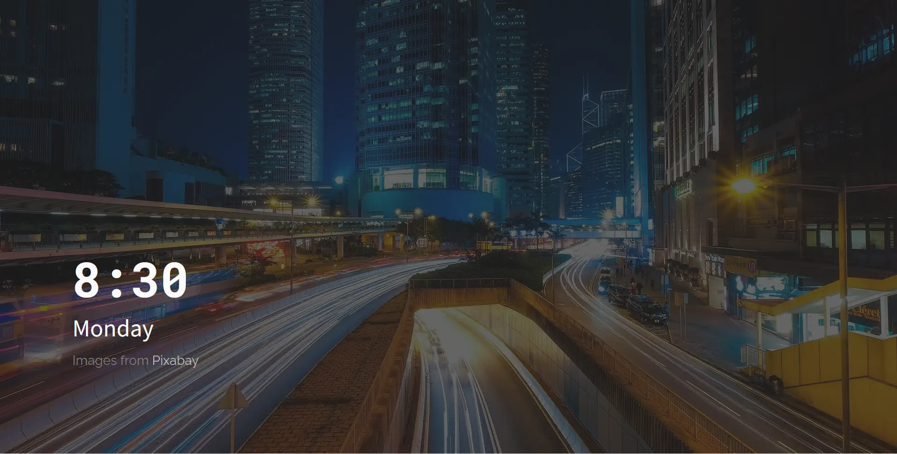
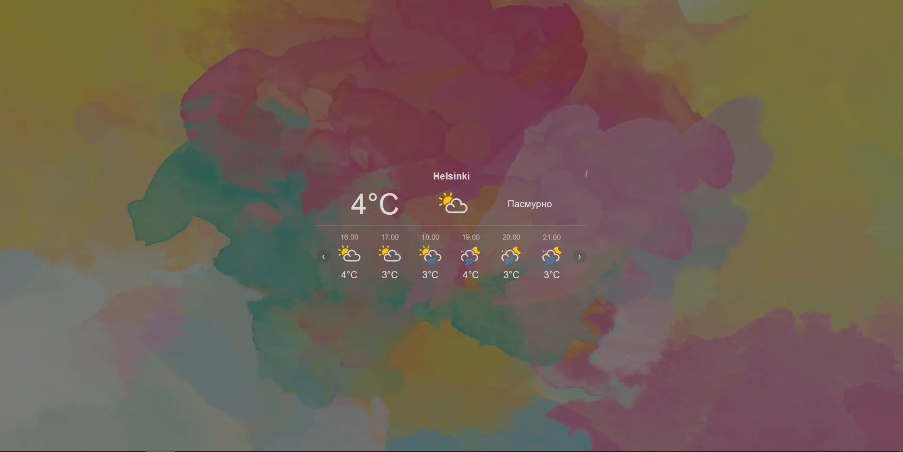

# //YMP TV Screensaver

***
### Unusual screensavers for your TV!
***

Hi everyone, I am a beginner developer. I have created an interesting and useful application with screensavers for your TV.

YMP TV Screensaver is an application that gives users the opportunity to use unusual screensavers and images on their devices.

The application has more than 5 active screensavers and images that can be used on the desktop. In addition, screensavers can display additional widgets: weather widget, clock widget and others.

The application provides users with the ability to quickly and easily install and modify screensavers.

⚠️ **I am not a professional coder and actively used neural networks when creating the project. Nevertheless, it turned out to be a pretty good project.**

[Google Play](https://play.google.com/store/apps/details?id=com.ymp.tv.tvscreensaver)
